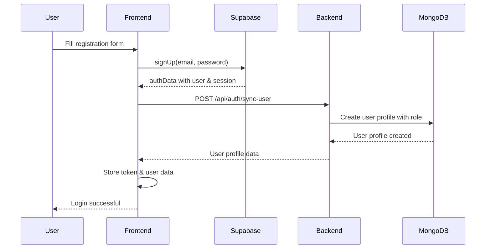
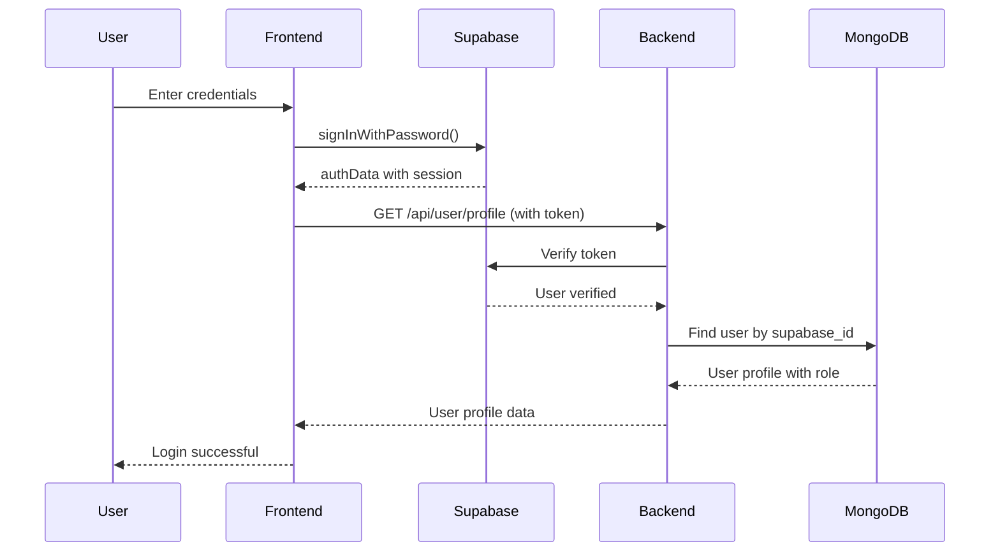

# MERN Authentication with Supabase RBAC Implementation Guide

## Table of Contents
1. [Overview](#overview)
2. [Prerequisites](#prerequisites)
3. [Architecture](#architecture)
4. [Step-by-Step Implementation](#step-by-step-implementation)
5. [Authentication Flow](#authentication-flow)
6. [Role-Based Access Control](#role-based-access-control)
7. [API Endpoints](#api-endpoints)
8. [Frontend Components](#frontend-components)
9. [Security Considerations](#security-considerations)
10. [Testing](#testing)
11. [Troubleshooting](#troubleshooting)

## Overview

This guide explains how to implement a Role-Based Access Control (RBAC) system in a MERN stack application using Supabase for authentication while maintaining custom user roles and permissions in MongoDB.

### Key Benefits
- **Secure Authentication**: Supabase handles password hashing, JWT generation, and email verification
- **Scalable RBAC**: Custom role system with hierarchical permissions
- **Hybrid Architecture**: Combines Supabase auth with MongoDB for extended user data
- **Production Ready**: Enterprise-grade authentication infrastructure

## Prerequisites

- Node.js and npm installed
- MongoDB database
- Supabase account
- Basic knowledge of React, Express, and MongoDB

## Architecture

```
┌─────────────────┐    ┌─────────────────┐    ┌─────────────────┐
│   Frontend      │    │   Backend       │    │   Databases     │
│   (React)       │    │   (Express)     │    │                 │
│                 │    │                 │    │  ┌─────────────┐│
│ ┌─────────────┐ │    │ ┌─────────────┐ │    │  │  Supabase   ││
│ │ Auth Forms  │ │◄──►│ │ Auth Routes │ │◄──►│  │ (Auth Only) ││
│ └─────────────┘ │    │ └─────────────┘ │    │  └─────────────┘│
│                 │    │                 │    │                 │
│ ┌─────────────┐ │    │ ┌─────────────┐ │    │  ┌─────────────┐│
│ │ Protected   │ │◄──►│ │ RBAC        │ │◄──►│  │  MongoDB    ││
│ │ Components  │ │    │ │ Middleware  │ │    │  │ (User Data) ││
│ └─────────────┘ │    │ └─────────────┘ │    │  └─────────────┘│
└─────────────────┘    └─────────────────┘    └─────────────────┘
```

## Step-by-Step Implementation

### 1. Supabase Project Setup

#### 1.1 Create Supabase Project
1. Go to [supabase.com](https://supabase.com)
2. Create new project
3. Wait for setup completion

#### 1.2 Configure Authentication
1. Navigate to **Authentication > Settings**
2. Configure email settings:
   ```
   Site URL: http://localhost:5173 (or your frontend URL)
   Redirect URLs: http://localhost:5173/**
   ```
3. **Disable email confirmation** for development:
   - Turn OFF "Enable email confirmations"
4. Copy credentials from **Settings > API**:
   - Project URL
   - `anon` public key
   - `service_role` secret key

### 2. Environment Configuration

#### 2.1 Frontend Environment (.env)
```env
VITE_SUPABASE_URL=your_supabase_project_url
VITE_SUPABASE_ANON_KEY=your_supabase_anon_key
```

#### 2.2 Backend Environment (.env)
```env
PORT=5000

# Supabase Configuration
SUPABASE_URL=your_supabase_project_url
SUPABASE_SERVICE_ROLE_KEY=your_supabase_service_role_key
```

### 3. Install Dependencies

#### 3.1 Frontend Dependencies
```bash
cd frontend
npm install @supabase/supabase-js
```

#### 3.2 Backend Dependencies
```bash
cd backend
npm install @supabase/supabase-js
```

### 4. Backend Implementation

#### 4.1 Supabase Client Configuration
**File: `backend/config/supabase.js`**
```javascript
const { createClient } = require('@supabase/supabase-js');
require('dotenv').config();

const supabaseUrl = process.env.SUPABASE_URL;
const supabaseServiceKey = process.env.SUPABASE_SERVICE_ROLE_KEY;

const supabase = createClient(supabaseUrl, supabaseServiceKey);

module.exports = supabase;
```

#### 4.2 Updated User Model
**File: `backend/models/User.js`**
```javascript
const mongoose = require('mongoose');

const userSchema = new mongoose.Schema({
  supabase_id: {
    type: String,
    required: [true, 'Supabase ID is required'],
    unique: true
  },
  username: {
    type: String,
    required: [true, 'Username is required'],
    unique: true,
    trim: true,
    minlength: [3, 'Username must be at least 3 characters long']
  },
  email: {
    type: String,
    required: [true, 'Email is required'],
    unique: true,
    lowercase: true,
    match: [/^\S+@\S+\.\S+$/, 'Please enter a valid email']
  },
  role: {
    type: String,
    enum: ['user', 'admin', 'moderator'],
    default: 'user',
    required: [true, 'Role is required']
  }
}, {
  timestamps: true
});

module.exports = mongoose.model('User', userSchema);
```

#### 4.3 Authentication Middleware
**File: `backend/middleware/auth.js`**
```javascript
const User = require('../models/User');
const supabase = require('../config/supabase');

const authenticateToken = async (req, res, next) => {
  try {
    const authHeader = req.header('Authorization');
    const token = authHeader && authHeader.startsWith('Bearer ')
      ? authHeader.substring(7)
      : null;

    if (!token) {
      return res.status(401).json({ message: 'Access token is required' });
    }

    // Verify token with Supabase
    const { data: { user }, error } = await supabase.auth.getUser(token);

    if (error || !user) {
      return res.status(401).json({ message: 'Invalid token' });
    }

    // Get user profile from MongoDB (for role info)
    const userProfile = await User.findOne({ supabase_id: user.id }).select('-password');

    if (!userProfile) {
      return res.status(401).json({ message: 'User profile not found' });
    }

    // Combine Supabase user data with profile data
    req.user = {
      ...userProfile.toObject(),
      supabase_user: user
    };

    next();

  } catch (error) {
    res.status(401).json({ message: 'Invalid token' });
  }
};

const authorize = (roles = []) => {
  return (req, res, next) => {
    try {
      if (!req.user) {
        return res.status(401).json({
          message: 'Authentication required'
        });
      }

      if (roles.length && !roles.includes(req.user.role)) {
        return res.status(403).json({
          message: `Access denied. Required role: ${roles.join(' or ')}`
        });
      }

      next();

    } catch (error) {
      res.status(500).json({
        message: 'Authorization error',
        error: error.message
      });
    }
  };
};

const requireAdmin = authorize(['admin']);
const requireModerator = authorize(['moderator', 'admin']);
const requireAuth = authorize([]);

module.exports = {
  authenticateToken,
  authorize,
  requireAdmin,
  requireModerator,
  requireAuth
};
```

#### 4.4 Authentication Routes
**File: `backend/routes/auth.js`**
```javascript
const express = require('express');
const User = require('../models/User');
const supabase = require('../config/supabase');
const router = express.Router();

// Route to sync user data after Supabase auth
router.post('/sync-user', async (req, res) => {
  try {
    const { supabase_id, username, email, role } = req.body;

    if (!supabase_id || !username || !email) {
      return res.status(400).json({
        message: 'Supabase ID, username, and email are required'
      });
    }

    // Check if user already exists
    let user = await User.findOne({ supabase_id });

    if (user) {
      // Update existing user
      user.username = username;
      user.email = email;
      if (role && ['user', 'admin', 'moderator'].includes(role)) {
        user.role = role;
      }
      await user.save();
    } else {
      // Create new user profile
      const validRoles = ['user', 'admin', 'moderator'];
      user = new User({
        supabase_id,
        username,
        email,
        role: role && validRoles.includes(role) ? role : 'user'
      });
      await user.save();
    }

    res.status(201).json({
      message: 'User profile synced successfully',
      user: {
        id: user._id,
        supabase_id: user.supabase_id,
        username: user.username,
        email: user.email,
        role: user.role
      }
    });

  } catch (error) {
    res.status(500).json({
      message: 'Server error',
      error: error.message
    });
  }
});

module.exports = router;
```

### 5. Frontend Implementation

#### 5.1 Supabase Client Configuration
**File: `frontend/src/lib/supabase.js`**
```javascript
import { createClient } from '@supabase/supabase-js'

const supabaseUrl = import.meta.env.VITE_SUPABASE_URL
const supabaseAnonKey = import.meta.env.VITE_SUPABASE_ANON_KEY

export const supabase = createClient(supabaseUrl, supabaseAnonKey)
```

#### 5.2 Login Component
**File: `frontend/src/components/Login.jsx`**
```javascript
import { useState } from 'react';
import axios from 'axios';
import { supabase } from '../lib/supabase';

const Login = ({ onLogin, switchToRegister }) => {
  const [formData, setFormData] = useState({
    email: '',
    password: ''
  });
  const [error, setError] = useState('');
  const [loading, setLoading] = useState(false);

  const handleSubmit = async (e) => {
    e.preventDefault();
    setLoading(true);
    setError('');

    try {
      // Sign in with Supabase
      const { data: authData, error: authError } = await supabase.auth.signInWithPassword({
        email: formData.email,
        password: formData.password,
      });

      if (authError) {
        setError(authError.message);
        return;
      }

      // Store the access token
      localStorage.setItem('token', authData.session.access_token);

      try {
        // Try to get user profile from your backend
        const response = await axios.get('http://localhost:5000/api/user/profile', {
          headers: { 'Authorization': `Bearer ${authData.session.access_token}` }
        });

        localStorage.setItem('user', JSON.stringify(response.data.user));
        onLogin(response.data.user);

      } catch (profileError) {
        // If profile doesn't exist, sync the user profile
        if (profileError.response?.status === 401) {
          const syncResponse = await axios.post('http://localhost:5000/api/auth/sync-user', {
            supabase_id: authData.user.id,
            username: authData.user.email.split('@')[0],
            email: authData.user.email,
            role: 'user'
          });

          localStorage.setItem('user', JSON.stringify(syncResponse.data.user));
          onLogin(syncResponse.data.user);
        } else {
          throw profileError;
        }
      }

    } catch (error) {
      setError(error.response?.data?.message || error.message || 'Login failed');
    } finally {
      setLoading(false);
    }
  };

  // ... rest of component JSX
};

export default Login;
```

#### 5.3 Registration Component
**File: `frontend/src/components/Register.jsx`**
```javascript
import { useState } from 'react';
import axios from 'axios';
import { supabase } from '../lib/supabase';

const Register = ({ onLogin, switchToLogin }) => {
  const [formData, setFormData] = useState({
    username: '',
    email: '',
    password: '',
    confirmPassword: '',
    role: 'user'
  });
  const [error, setError] = useState('');
  const [loading, setLoading] = useState(false);

  const handleSubmit = async (e) => {
    e.preventDefault();

    if (formData.password !== formData.confirmPassword) {
      setError('Passwords do not match');
      return;
    }

    setLoading(true);
    setError('');

    try {
      // Sign up with Supabase
      const { data: authData, error: authError } = await supabase.auth.signUp({
        email: formData.email,
        password: formData.password,
      });

      if (authError) {
        setError(authError.message);
        return;
      }

      // Check if user has session (auto-confirmed)
      if (authData.session) {
        const token = authData.session.access_token;

        const response = await axios.post('http://localhost:5000/api/auth/sync-user', {
          supabase_id: authData.user.id,
          username: formData.username,
          email: formData.email,
          role: formData.role
        });

        localStorage.setItem('token', token);
        localStorage.setItem('user', JSON.stringify(response.data.user));
        onLogin(response.data.user);

      } else {
        setError('Registration successful! Please check your email to confirm your account.');
      }

    } catch (error) {
      setError(error.response?.data?.message || error.message || 'Registration failed');
    } finally {
      setLoading(false);
    }
  };

  // ... rest of component JSX
};

export default Register;
```

#### 5.4 App Component with Logout
**File: `frontend/src/App.jsx`**
```javascript
import { useState, useEffect } from 'react';
import { supabase } from './lib/supabase';
// ... other imports

function App() {
  const [user, setUser] = useState(null);
  const [loading, setLoading] = useState(true);

  useEffect(() => {
    const token = localStorage.getItem('token');
    const userData = localStorage.getItem('user');

    if (token && userData) {
      setUser(JSON.parse(userData));
    }

    setLoading(false);
  }, []);

  const handleLogout = async () => {
    await supabase.auth.signOut();
    localStorage.removeItem('token');
    localStorage.removeItem('user');
    setUser(null);
  };

  // ... rest of component
}
```

## Authentication Flow

### Registration Flow


### Login Flow


## Role-Based Access Control

### Role Hierarchy
```
Admin (Full Access)
├── User Management
├── Role Assignment
├── System Statistics
├── Content Moderation
└── All User/Moderator permissions

Moderator (Limited Admin)
├── System Statistics
├── Content Moderation
└── All User permissions

User (Basic Access)
├── Profile Management
└── Basic Features
```

### Permission System
**File: `backend/routes/user.js`**
```javascript
// Example protected routes with different access levels

// User level - any authenticated user
router.get('/profile', authenticateToken, async (req, res) => {
  // User profile access
});

// Moderator level - moderators and admins
router.get('/mod/stats', authenticateToken, requireModerator, async (req, res) => {
  // Statistics access
});

// Admin level - admins only
router.get('/admin/users', authenticateToken, requireAdmin, async (req, res) => {
  // User management access
});

router.put('/admin/users/:id/role', authenticateToken, requireAdmin, async (req, res) => {
  // Role assignment access
});
```

### Frontend Permission Checks
```javascript
const hasPermission = (userRole, requiredRole) => {
  const roleHierarchy = {
    'user': 1,
    'moderator': 2,
    'admin': 3
  };

  return roleHierarchy[userRole] >= roleHierarchy[requiredRole];
};

// Usage in components
{hasPermission(user.role, 'admin') && (
  <AdminPanel />
)}
```

## API Endpoints

### Authentication Endpoints
| Method | Endpoint | Description | Access Level |
|--------|----------|-------------|--------------|
| POST | `/api/auth/sync-user` | Sync user profile after Supabase auth | Public |

### User Management Endpoints
| Method | Endpoint | Description | Access Level |
|--------|----------|-------------|--------------|
| GET | `/api/user/profile` | Get current user profile | Authenticated |
| GET | `/api/user/permissions` | Get user permissions | Authenticated |
| GET | `/api/user/mod/stats` | Get system statistics | Moderator+ |
| GET | `/api/user/admin/users` | List all users | Admin |
| PUT | `/api/user/admin/users/:id/role` | Update user role | Admin |
| DELETE | `/api/user/admin/users/:id` | Delete user | Admin |

## Security Considerations

### 1. Token Security
- Supabase JWTs are verified server-side
- Tokens stored in localStorage (consider httpOnly cookies for production)
- Automatic token refresh handled by Supabase

### 2. Role Protection
- Role validation on both frontend and backend
- Backend middleware prevents privilege escalation
- Database constraints ensure data integrity

### 3. Input Validation
```javascript
// Example validation in sync-user endpoint
const { supabase_id, username, email, role } = req.body;

// Validate required fields
if (!supabase_id || !username || !email) {
  return res.status(400).json({
    message: 'Required fields missing'
  });
}

// Validate role
const validRoles = ['user', 'admin', 'moderator'];
if (role && !validRoles.includes(role)) {
  return res.status(400).json({
    message: 'Invalid role specified'
  });
}
```

### 4. Admin Protection
```javascript
// Prevent self-demotion/deletion
if (id === req.user._id.toString() && role !== 'admin') {
  return res.status(400).json({
    message: 'Cannot change your own admin role'
  });
}

if (id === req.user._id.toString()) {
  return res.status(400).json({
    message: 'Cannot delete your own account'
  });
}
```

## Testing

### 1. Development Setup
```bash
# Start backend
cd backend && npm run dev

# Start frontend
cd frontend && npm run dev
```

### 2. Test User Flows

#### Test Registration
1. Register new user with different roles
2. Verify user created in both Supabase and MongoDB
3. Test login with new credentials

#### Test Authentication
1. Login with valid credentials
2. Verify token storage and user data
3. Test protected route access

#### Test RBAC
1. Create users with different roles
2. Test access to role-specific features
3. Verify permission-based UI rendering

### 3. Database Verification
```javascript
// Check MongoDB user creation
db.users.find({ email: "test@example.com" });

// Check Supabase users in dashboard
// Authentication > Users section
```

## Troubleshooting

### Common Issues

#### 1. "User profile not found" Error
**Cause**: User exists in Supabase but not synced to MongoDB
**Solution**:
- Check if sync-user endpoint is being called
- Verify MongoDB connection
- Check console logs for sync errors

#### 2. Email Confirmation Issues
**Cause**: Email confirmation enabled in Supabase
**Solutions**:
- Disable email confirmation in Supabase for development
- Configure proper email templates and SMTP
- Handle confirmation flow in registration component

#### 3. Token Verification Failures
**Cause**: Invalid or expired tokens
**Solutions**:
- Check Supabase service role key configuration
- Verify token format (Bearer prefix)
- Implement token refresh logic

#### 4. Role Permission Errors
**Cause**: Incorrect role validation or hierarchy
**Solutions**:
- Verify role enum values match
- Check middleware order in routes
- Validate role assignment logic

### Debug Steps

1. **Check Environment Variables**
```bash
# Verify all required env vars are set
echo $SUPABASE_URL
echo $SUPABASE_SERVICE_ROLE_KEY
```

2. **Enable Debug Logging**
```javascript
// Add to auth middleware
console.log('Token:', token);
console.log('Supabase user:', user);
console.log('MongoDB profile:', userProfile);
```

3. **Verify Database Connections**
```javascript
// Test MongoDB connection
mongoose.connection.on('connected', () => {
  console.log('MongoDB connected');
});

// Test Supabase connection
const testSupabase = async () => {
  const { data, error } = await supabase.auth.getSession();
  console.log('Supabase test:', { data, error });
};
```

4. **Frontend Network Tab**
- Check API calls in browser dev tools
- Verify request headers include Authorization
- Check response status codes and error messages

## Production Deployment

### 1. Environment Configuration
- Set production URLs in Supabase dashboard
- Configure proper CORS settings
- Use secure token storage (httpOnly cookies)

### 2. Security Hardening
- Enable email confirmation
- Configure rate limiting
- Implement proper error handling
- Add request validation middleware

### 3. Monitoring
- Set up logging for auth events
- Monitor failed login attempts
- Track user registration patterns
- Alert on suspicious activities

---

## Conclusion

This RBAC implementation with Supabase provides a robust, scalable authentication system while maintaining flexible role management. The hybrid approach leverages Supabase's authentication infrastructure while preserving custom business logic in your application database.

For questions or issues, refer to:
- [Supabase Documentation](https://supabase.com/docs)
- [Express.js Documentation](https://expressjs.com/)
- [Mongoose Documentation](https://mongoosejs.com/)